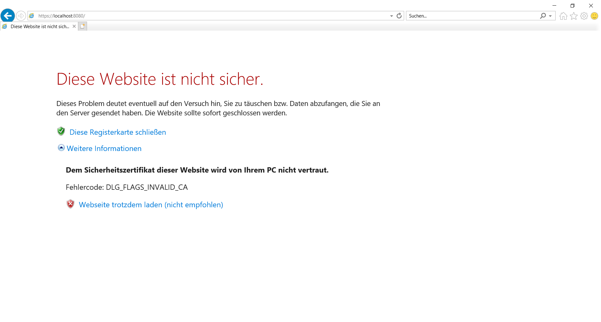
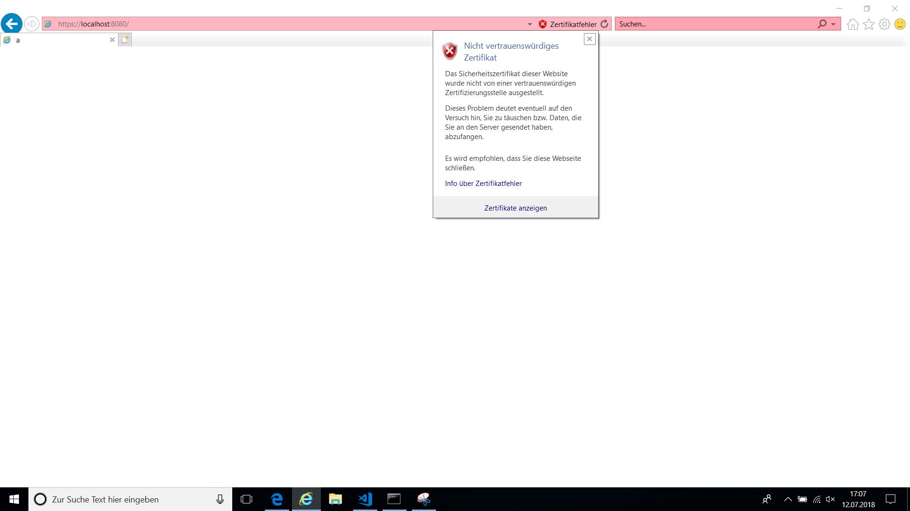
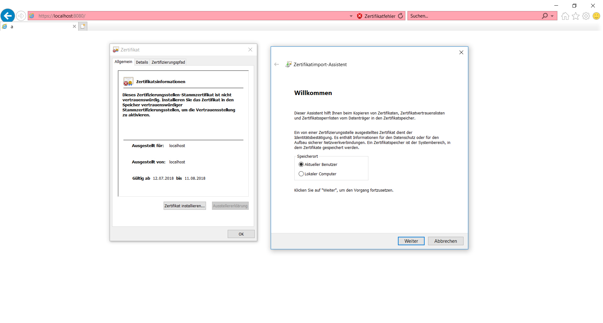
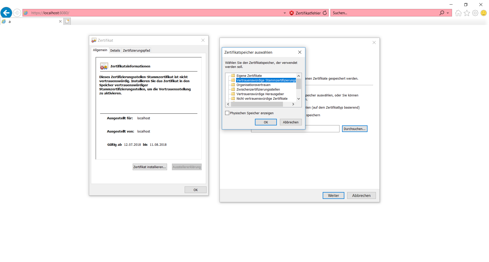

# Install self-signed SSL Certificate in IE 11 and Edge

> First of all, keep in mind that even if you only need to support the Edge browser, you should perform the following steps in IE11 - the > changes will be applied to both Edge and IE11.

After executing `npm start`, open the IE 11 browser to the defined URL direction (e.g. `https://localhost:8080`). You will see that the browser will block the current page for security reasons, because no SSL certificate is defined for this URL.

We will have to click the **More information** button, and allow to load the page by clicking **Go on to the webpage (not recommended)**.

You will see that the direction box is painted red, showing that the current page is not secure. You will have to trust the self-signed  SSL certificate. To do so, click on the red shield icon and click **View certificates**.

A dialog will be displayed. We will click the button **Install certificate**, which opens a new dialog. To trust the SSL certificate for the current user, we will select **Current user** as place to save the certificate and we will click **Next**.

Browse in **Place all certificates in the following store** (do not choose preselected option to automatically select the certificate store!) and select the type of certificate **Trusted Root Certificate Authorities**. At the end, confirm and allow the installation of the certificate.

To make the red warning disappear, we have to open a new tab. Now, the browser should not prevent the page from loading due to the self-signed SSL certificate anymore.
